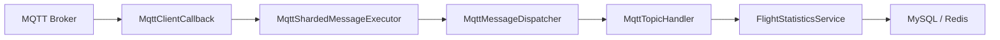
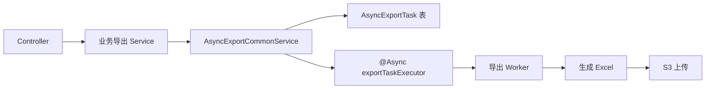

# JA-UAV-Data-Engine 服务说明与线程模型设计

## 1. 这个服务是干什么的

`JA-UAV-Data-Engine` 是一个面向无人机物联网数据接入与统计分析的后端服务。

它当前主要承担两类职责：

1. 接入设备 MQTT 属性上报，把原始消息转成可查询、可统计的业务数据。
2. 提供设备属性查询、飞行统计查询、异步导出等对外能力。

结合当前代码，这个服务不是一个“纯粹的消息转发器”，而是一个同时具备以下能力的数据引擎：

- 接入无人机设备上报的属性消息
- 对飞行累计指标做增量处理和架次沉淀
- 提供飞行统计查询接口
- 提供设备属性分页查询接口
- 提供设备属性、飞行统计的异步导出能力
- 统一管理 MQTT 入站、对象存储上传、异步任务状态

## 2. 当前业务边界

### 2.1 飞行统计

当前飞行统计链路只处理指定产品：

- `productKey = 00000000002`

它消费的 MQTT 主题为：

- `sys/{productKey}/{deviceId}/thing/event/property/post`

它重点处理消息中的累计字段：

- `totalFlightSorties`
- `totalFlightTime`
- `totalFlightDistance`

服务会根据累计值变化，把设备当前状态和飞行架次明细沉淀到 MySQL，同时利用 Redis 缓存最近处理到的累计架次，减少重复回源数据库。

### 2.2 设备属性

设备属性能力主要面向 Doris 中的设备属性明细数据，提供：

- 分页查询
- 设备属性异步导出

### 2.3 对外接口

当前对外能力主要集中在两个控制器：

- [DeviceAttrInfoController.java](/Users/wangyongzhen/JA-UAV-Data-Engine/engine-api/src/main/java/com/jingansi/uav/engine/api/controller/DeviceAttrInfoController.java)
- [FlightStatisticsController.java](/Users/wangyongzhen/JA-UAV-Data-Engine/engine-api/src/main/java/com/jingansi/uav/engine/api/controller/FlightStatisticsController.java)

高频接口包括：

- 设备属性分页查询
- 设备属性异步导出任务创建/任务查询/下载地址获取
- 飞行统计总览查询
- 飞行统计区间查询
- 飞行架次明细查询
- 飞行统计导出

## 3. 模块分工

当前项目已经按“业务域 + 基础设施/接入层”拆分：

- `engine-api`
  - Spring Boot 启动入口
  - Web 接口
  - MQTT 客户端初始化
  - 异步线程池配置
- `engine-biz`
  - 业务域逻辑
  - MQTT 接入链路
  - 异步导出公共能力
  - S3 对象存储能力
- `engine-dao`
  - 实体、Mapper、数据库访问
- `engine-common`
  - 公共 DTO、VO、常量、枚举、MQTT 消息模型

`engine-biz` 的主结构如下：

- `device.attr`
  - 设备属性查询与导出
- `flight.statistics`
  - 飞行统计查询、MQTT 处理、导出
- `integration.mqtt`
  - MQTT 配置、分发、运行时组件、压测工具
- `infrastructure.export`
  - 异步导出公共流程
- `infrastructure.storage.s3`
  - S3 配置与对象存储实现

这套结构的核心价值是：

- 业务域按“设备属性/飞行统计”看代码
- 接入层按“MQTT”看代码
- 基础设施按“导出/S3”看代码

新人进入项目后，不需要先猜“这个东西是 Doris 的、还是 export 的、还是 storage 的”，而是先按职责找。

## 4. 核心数据流

### 4.1 MQTT 入站链路

处理步骤如下：

1. 原生 Paho 客户端收到 MQTT 消息。
2. `MqttClientCallback` 不直接跑业务，只负责把消息交给分片执行器。
3. `MqttShardedMessageExecutor` 按 `deviceId` 做分片入队。
4. 每个分片 worker 从自己的队列中取消息，交给 `MqttMessageDispatcher`。
5. 分发器统一解析 topic、消息头、消息体，并路由到匹配的 `MqttTopicHandler`。
6. 具体业务 handler 再调用对应业务服务。

这条链路的重点不是“能处理消息”，而是“能稳定地持续处理消息”。

### 4.2 异步导出链路

处理步骤如下：

1. 控制器提交导出请求。
2. 业务导出 Service 把自己的差异参数交给公共导出服务。
3. 公共导出服务负责校验、限流、落任务表、触发异步处理。
4. 具体 Worker 在异步线程中生成文件并上传 S3。
5. 任务状态写回 `AsyncExportTask`，前端可轮询任务状态和下载地址。

## 5. 线程模型与线程池设计

这套服务真正值得讲的，不只是“用了线程池”，而是不同线程池各自只做一件事，而且职责边界很清晰。

### 5.1 线程层次总览

当前项目有三层并发模型：

1. MQTT 生命周期线程
2. MQTT 入站分片工作线程
3. 异步导出线程池

它们分别解决的是三类完全不同的问题：

- 生命周期线程解决“启动与重连不要阻塞应用启动”
- 分片 worker 解决“高并发入站时既要并行，又要保证单设备顺序”
- 导出线程池解决“导出是重任务，必须隔离，不能无限堆积”

### 5.2 MQTT 生命周期线程：把连接和订阅从启动主路径里拿掉

对应类：

- [MqttClientLifecycle.java](/Users/wangyongzhen/JA-UAV-Data-Engine/engine-biz/src/main/java/com/jingansi/uav/engine/biz/integration/mqtt/runtime/MqttClientLifecycle.java)

设计点：

- 使用单线程 `Executors.newSingleThreadExecutor(...)`
- 应用 `ApplicationReadyEvent` 之后再后台连接 MQTT
- 初次连接失败时固定间隔重试

这样做的价值：

- Spring Boot 主启动链不被 MQTT 建连卡住
- Broker 短暂不可用时，服务仍能先起来
- 重试逻辑集中在一个地方，排查简单

这不是为了“多线程炫技”，而是为了把“应用启动成功”和“外部依赖就绪”解耦。

### 5.3 MQTT 回调线程：只入队，不做业务

对应类：

- [MqttClientCallback.java](/Users/wangyongzhen/JA-UAV-Data-Engine/engine-biz/src/main/java/com/jingansi/uav/engine/biz/integration/mqtt/runtime/MqttClientCallback.java)

关键设计：

- `messageArrived(...)` 不直接执行业务逻辑
- 回调线程只负责把消息提交给 `MqttShardedMessageExecutor`

这一步非常关键。

如果在 Paho 的 callback 线程里直接查库、写库、解析复杂 JSON、跑统计逻辑，会有几个问题：

- 回调线程容易被单条慢消息拖住
- 后续消息积压在客户端回调链路中
- 系统吞吐和时延都不可控
- 排查问题时很难区分“MQTT 慢”还是“业务慢”

当前设计通过“回调线程只做转交”把这些问题切开了。

### 5.4 MQTT 入站分片线程池：并行处理，但不打乱单设备顺序

对应类：

- [MqttShardedMessageExecutor.java](/Users/wangyongzhen/JA-UAV-Data-Engine/engine-biz/src/main/java/com/jingansi/uav/engine/biz/integration/mqtt/runtime/MqttShardedMessageExecutor.java)
- [IotMqttProperties.java](/Users/wangyongzhen/JA-UAV-Data-Engine/engine-biz/src/main/java/com/jingansi/uav/engine/biz/integration/mqtt/config/IotMqttProperties.java)

默认参数：

- `workerCount = 16`
- `queueCapacity = 2048`

这个线程池设计的精妙点，核心在于“按 `deviceId` 分片”。

它不是简单地把所有消息扔给一个公共线程池，而是：

1. 先从 topic 中解析 `deviceId`
2. 对 `deviceId` 做 hash 扰动
3. 固定映射到某一个 worker
4. 每个 worker 都有自己的有界队列

这带来三个很重要的结果：

#### 第一，单设备顺序天然稳定

同一个 `deviceId` 的消息会一直落到同一个 worker。

这意味着：

- 同一设备不会并发修改飞行状态
- 不需要为“单设备顺序”再额外上锁
- 业务层可以把重点放在累计值计算，而不是并发冲突处理

对于飞行统计这种“累计架次递增、上一架次结算、下一架次占位”的业务，这是非常合适的。

#### 第二，多设备可以并行

不同设备的消息会分散到不同 worker。

这意味着：

- 一台热点设备不会阻塞所有设备
- 并发能力可以随 `workerCount` 扩展
- 系统吞吐不会被单线程上限锁死

也就是说，这个模型不是“全局串行”，而是“设备内串行、设备间并行”。

这正是这类物联网统计服务最合适的并发粒度。

#### 第三，使用有界队列而不是无限堆积

每个 worker 都是 `ArrayBlockingQueue`，容量来自配置。

这意味着设计目标是：

- 优先限制内存占用
- 优先保证有压力时系统行为可预测
- 不让线程池和消息堆积无限膨胀

当前代码在队列满时采用 `queue.put(...)` 阻塞等待，体现出的设计取向是：

- 优先保证不丢消息
- 优先保证顺序不乱
- 接受在极端压力下施加反压

这类取舍非常适合“状态型处理”而不是“纯日志吞吐型处理”的业务。

### 5.5 为什么 `workerCount` 强调 2 的幂

配置中已经明确说明：

- `workerCount` 要保证为 `2^n`

原因不是形式要求，而是当前分片下标计算使用了：

- `spreadHash(shardKey) & (shardCount - 1)`

这个写法相比取模有两个好处：

- 计算更轻
- 配合高低位扰动，低位分布更稳

这说明当前设计不是随便“写个 hash 分片”，而是考虑过 hash 分布质量和运行时开销的。

### 5.6 Dispatcher 不是线程池，但它是并发链路里的关键优化点

对应类：

- [MqttMessageDispatcher.java](/Users/wangyongzhen/JA-UAV-Data-Engine/engine-biz/src/main/java/com/jingansi/uav/engine/biz/integration/mqtt/dispatch/MqttMessageDispatcher.java)

这里还有一个容易被忽略但很关键的优化：

- 按“具体 topic”缓存匹配到的 handler 列表

因为 handler 支持 `+` / `#` 通配符，所以不能简单做 `Map<String, Handler>`。
当前做法是：

1. 某个具体 topic 第一次到来时解析匹配关系
2. 把结果缓存在 `ConcurrentHashMap`
3. 后续相同 topic 直接命中缓存

这样可以明显减少高频消息下重复做 topic 模式匹配的成本。

### 5.7 异步导出线程池：重任务隔离 + 零队列快速失败

对应类：

- [AsyncConfiguration.java](/Users/wangyongzhen/JA-UAV-Data-Engine/engine-api/src/main/java/com/jingansi/uav/engine/api/config/AsyncConfiguration.java)
- [AsyncExportCommonService.java](/Users/wangyongzhen/JA-UAV-Data-Engine/engine-biz/src/main/java/com/jingansi/uav/engine/biz/infrastructure/export/AsyncExportCommonService.java)

当前导出线程池参数：

- `corePoolSize = 2`
- `maxPoolSize = 2`
- `queueCapacity = 0`
- `RejectedExecutionHandler = AbortPolicy`

这套参数组合表达得很明确：

- 导出任务就是重任务
- 不允许无限排队
- 超过处理能力时，宁可快速失败，也不让系统悄悄积压

它的设计理念不是“尽可能接住所有导出请求”，而是：

- 把导出资源上限写死
- 对系统容量有清晰认知
- 超载时立即向上返回忙碌信号

这比“线程池有很长队列，任务全部先接住，最后慢慢拖死”要成熟得多。

### 5.8 业务限流 + 线程池限流是双层保护

导出链路不是只依赖线程池控制。

业务侧的公共导出服务还做了额外限制：

- 按导出类型统计 `PENDING/RUNNING` 任务数
- 超过上限直接返回“有任务正在查询，请稍后再试”

也就是说，导出能力的控制并不是单点依赖线程池，而是两层：

1. 业务层控制“允许存在多少个活跃任务”
2. 线程池控制“系统实际只放行多少个执行线程”

这类双层保护对导出场景很有价值，因为导出通常会同时消耗：

- 数据库查询资源
- 文件生成 CPU/内存
- 磁盘临时文件
- 对象存储上传带宽

## 6. 这套线程设计为什么适合当前项目

总结下来，这套线程模型之所以合适，不是因为用了很多线程，而是因为每一层都在解决一个非常具体的问题。

### 6.1 对 MQTT 接入场景合适

当前服务面对的是设备持续上报，不是一次性批处理。

它要求：

- 设备消息不能乱序
- 高并发时不能全部串行
- 回调线程不能被业务拖死

分片执行器正好满足这三点。

### 6.2 对飞行统计场景合适

飞行统计的处理模型本质上依赖“累计值有序推进”。

如果同一个设备的消息并发乱入，就容易出现：

- 上一架次和下一架次结算错乱
- Redis 与数据库状态不一致
- 累计架次回退判断失真

当前按设备分片的设计天然降低了这类并发问题。

### 6.3 对导出场景合适

导出不是高频轻量任务，而是典型重任务。

所以导出线程池的重点不是吞吐最大化，而是：

- 把影响范围锁在小范围
- 避免把在线查询和消息处理资源吃光
- 超限时快速给出反馈

这是一种很务实的设计取向。

## 7. 新人理解这个服务时，建议先看哪里

推荐阅读顺序：

1. [DeviceAttrInfoController.java](/Users/wangyongzhen/JA-UAV-Data-Engine/engine-api/src/main/java/com/jingansi/uav/engine/api/controller/DeviceAttrInfoController.java)
2. [FlightStatisticsController.java](/Users/wangyongzhen/JA-UAV-Data-Engine/engine-api/src/main/java/com/jingansi/uav/engine/api/controller/FlightStatisticsController.java)
3. [MqttClientConfiguration.java](/Users/wangyongzhen/JA-UAV-Data-Engine/engine-api/src/main/java/com/jingansi/uav/engine/api/config/MqttClientConfiguration.java)
4. [MqttClientCallback.java](/Users/wangyongzhen/JA-UAV-Data-Engine/engine-biz/src/main/java/com/jingansi/uav/engine/biz/integration/mqtt/runtime/MqttClientCallback.java)
5. [MqttShardedMessageExecutor.java](/Users/wangyongzhen/JA-UAV-Data-Engine/engine-biz/src/main/java/com/jingansi/uav/engine/biz/integration/mqtt/runtime/MqttShardedMessageExecutor.java)
6. [MqttMessageDispatcher.java](/Users/wangyongzhen/JA-UAV-Data-Engine/engine-biz/src/main/java/com/jingansi/uav/engine/biz/integration/mqtt/dispatch/MqttMessageDispatcher.java)
7. [FlightStatisticsServiceImpl.java](/Users/wangyongzhen/JA-UAV-Data-Engine/engine-biz/src/main/java/com/jingansi/uav/engine/biz/flight/statistics/impl/FlightStatisticsServiceImpl.java)
8. [AsyncExportCommonService.java](/Users/wangyongzhen/JA-UAV-Data-Engine/engine-biz/src/main/java/com/jingansi/uav/engine/biz/infrastructure/export/AsyncExportCommonService.java)

按这个顺序看，会比较容易形成完整认知：

- 服务对外提供什么
- MQTT 怎么接进来
- 为什么线程不乱
- 导出为什么不会无限积压

## 8. 一句话总结

这个服务本质上是一个“无人机设备数据接入 + 状态沉淀 + 统计查询 + 异步导出”的数据引擎。

它在线程模型上的优秀之处，不是线程多，而是分工非常清楚：

- 启动线程负责连 MQTT
- 回调线程只负责转交
- 分片 worker 负责设备内有序、设备间并行
- 导出线程池负责重任务隔离和快速失败

这是一套明显偏工程化、可运营、可扩展的设计，而不是只追求“功能能跑通”的实现。
